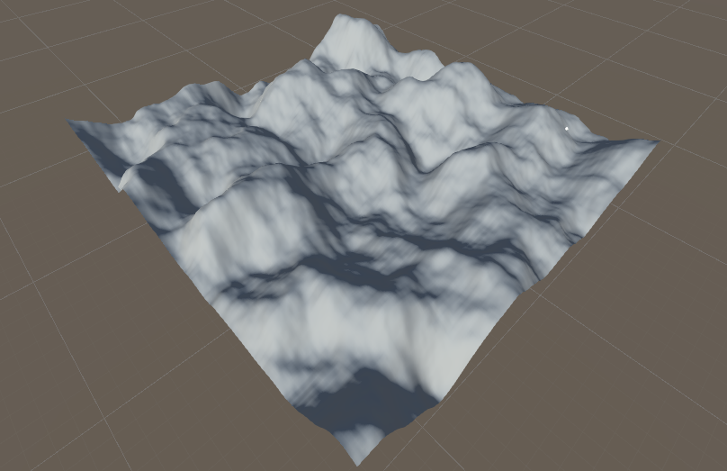

# Mini_Procedural_Generation
Unity procedural generation demonstrating typical noise-based procedural generation, minecraft procedural generation and other techniques.

<!--
*** Thanks for checking out the Best-README-Template. If you have a suggestion
*** that would make this better, please fork the repo and create a pull request
*** or simply open an issue with the tag "enhancement".
*** Thanks again! Now go create something AMAZING! :D
-->

<!-- ABOUT THE PROJECT -->
## About The Project

This project is a mini project undertaken by myself to study the development of procedural generation in games and for other potential application. This is strictly made to be developed on Desktop/PC. 

The project undergoes development of both active and offline procedural generation. Additionally, further work will experiment with development on minecraft-like procedural generation and other procedural generation techniques for games programming. Development of different generation areas will utilise either single threaded or multi-threaded applications through both traditional programming and compute shaders.

### Built With

This section should list any major frameworks that you built your project using. Leave any add-ons/plugins for the acknowledgements section. Here are a few examples.
* [C#](https://docs.microsoft.com/en-us/dotnet/csharp/)
* [HLSL](https://docs.microsoft.com/en-us/windows/win32/direct3dhlsl/dx-graphics-hlsl)
* [Unity](https://unity.com/)

<!-- CONTACT -->
## Contact

Twitter - [@ChicoteJaiden](https://twitter.com/ChicoteJaiden)
Instagram - [@mr_i_art](https://www.instagram.com/mr_i_art/)
Itch.io - (https://jaidenchicote.itch.io/)
