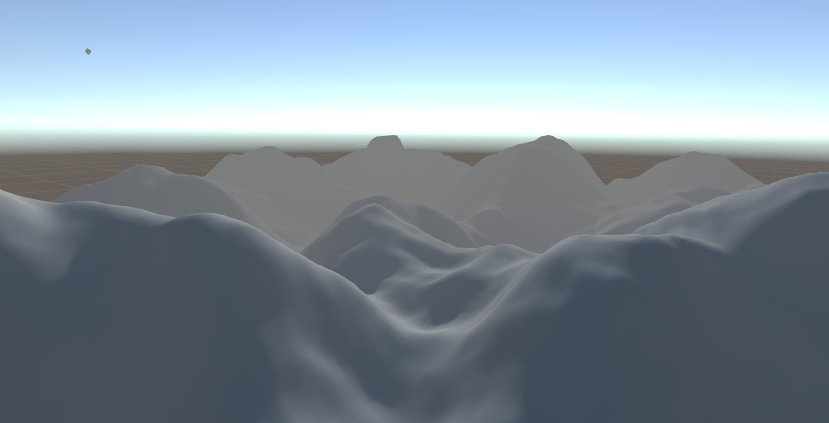

# Mini_Procedural_Generation

Unity procedural generation demonstrating typical noise-based procedural generation, minecraft procedural generation and other techniques.

<!-- ABOUT THE PROJECT -->
## About The Project

This project is a mini project undertaken by myself to study the development of procedural generation in games and for other potential application. This is strictly made to be developed on Desktop/PC. 

The project undergoes development of both active and offline procedural generation. Additionally, further work will experiment with development on minecraft-like procedural generation and other procedural generation techniques for games programming. Development of different generation areas will utilise either single threaded or multi-threaded applications through both traditional programming and compute shaders.

The first version of the generator is available in [Itch.io](https://jaidenchicote.itch.io/mini-procedural-generation)

### Installation

1. Before cloning project, ensure to have Unity HUB installed for ease of managing project versions. Within the 'install' tab of the Unity HUB window, download the Unity version mentioned above (in Prerequisites). Refer to the Unity Archive to search for previous versions: [Unity Archive](https://unity3d.com/get-unity/download/archive)
2. Clone the project then select the add button within Unity HUB to browse the path to your cloned repository. This will add the project to list of Unity projects.
3. Ensure to change the Unity Version through the dropdown, and select the version mentioned above.
4. Now it's ready and open the project :)

## Built With

This section should list any major frameworks that you built your project using. Leave any add-ons/plugins for the acknowledgements section. Here are a few examples.
* [C#](https://docs.microsoft.com/en-us/dotnet/csharp/)
* [HLSL](https://docs.microsoft.com/en-us/windows/win32/direct3dhlsl/dx-graphics-hlsl)
* [Unity](https://unity.com/)

<!-- CONTACT -->
## Contact

Twitter - [@ChicoteJaiden](https://twitter.com/ChicoteJaiden)
Instagram - [@mr_i_art](https://www.instagram.com/mr_i_art/)
Itch.io - (https://jaidenchicote.itch.io/)
